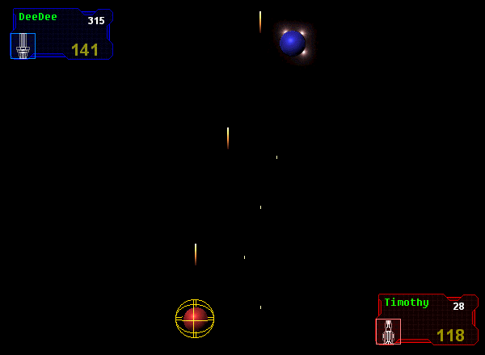



## BOTMATCH \- \*\*UPDATED\*\* \- see screen shot \- AI, 2 player battle, fast moving and FUN\!

### Description

This is an update to the game I submitted a few months back called BOTMATCH, a fast moving action-packed game... Now with the new BOTMATCH I've completed the AI player, which is a worthy oponent for the best of arcade junkys, with 2 different skill levels (easy and hard), lots of options (different graphics levels etc) and an updated GUI which meets the standard of professional games.

The game is HEAVILY commented and should provide at least some insight into the world of game design in VB. Hope you like it.

PS - I was surprised but the AI actually beet me at my own game when I set the speed to FAST and the Difficulty to HARD.

Enjoy!
 
### More Info
 

             |
---                |---
**Submitted On**   |2001-12-29 21:42:54
**By**             |[\(Tim Miron\) yar\-interactive software](https://github.com/Planet-Source-Code/PSCIndex/blob/master/ByAuthor/tim-miron-yar-interactive-software.md)
**Level**          |Intermediate
**User Rating**    |4.6 (64 globes from 14 users)
**Compatibility**  |VB 4\.0 \(32\-bit\), VB 5\.0, VB 6\.0
**Category**       |[Games](https://github.com/Planet-Source-Code/PSCIndex/blob/master/ByCategory/games__1-38.md)
**World**          |[Visual Basic](https://github.com/Planet-Source-Code/PSCIndex/blob/master/ByWorld/visual-basic.md)
**Archive File**   |[BOTMATCH\_\-4467212292001\.zip](https://github.com/Planet-Source-Code/tim-miron-yar-interactive-software-botmatch-updated-see-screen-shot-ai-2-player-battle-fas__1-30219/archive/master.zip)

